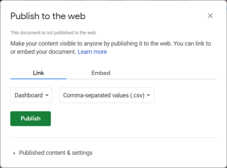
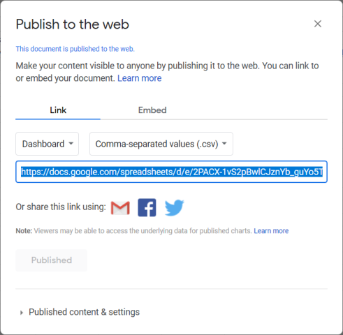

# Membuat Spreadsheet

1. Akses [https://drive.google.com](https://drive.google.com)
2. Klik **New - Google Sheets - Blank spreadsheet**
3. Pada halaman Spreadsheet klik **File - Import - Upload**
4. Upload file **BackEnd Leaflet Spreadsheet Covid-19.xlsx** dari folder **_template**
5. Pilih **Replace spreadsheet** kemudian klik **Import data**
6. Ubahlah pada sheet Data menjadi data di wilayah Anda dengan format sama dengan template.
7. Kolom KODE sebagai *primary key* untuk join data dengan file GeoJSON

---

## Publish Sebagai CSV

1. Klik **File - Publish to the web**
2. Pilih sheet **Dashboard** pada _dropdown_ **Entire Document**
3. Pilih **Comma-separated values (.csv)** pada dropdown sebelahnya

	

4. Klik **Publish** maka Anda akan mendapatkan link URL CSV dari sheet Dashboard

	

5. Buka **spreadsheetconfig.php** dari folder **data** kemudian gunakan link URL CSV sheet Dashboard tersebut untuk mengganti URL dari variabel _**$dashboardSpreadsheetUrl**_

6. Ubahlah judul_tab, judul_navbar, instansi, dll pada spreadsheet Dashboard Anda, maka tampilan dashboard akan berubah sesuai dengan spreadsheet Dashboard Anda.

7. Lakukan langkah 1 - 5 untuk mengubah link URL sheet Data dan Total supaya sesuai dengan link URL dari spreadsheet Anda.

---
> [<< Kembali ke halaman utama](../README.md)